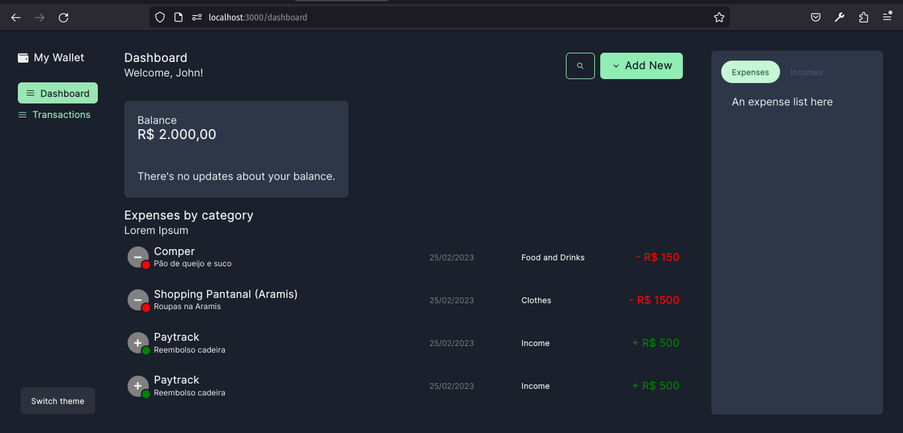

# My Wallet Project

## First steps

> This step is focused on environment configuration, package installation and adjust of project structure.

### Design

  - [x] Save a landing page as example, on Figma;
  - [x] Choose a color palette on Colorhunt and save a screenshot on Figma.

### What is already done?

Although there are several things that I need to implement and improve in
the system, the following screenshots shows what has been done so far:

#### First dashboard

<kbd></kbd>

### Project structure

  - [x] Start project repository on Github, using CRA;
  - [x] Define project's structure folder;
  - [x] Make the first route system configuration;
  - [x] Set the project state management, something like *Redux*;
  - [x] Install CSS-in-JS, something like Styled Components, SASS, LESS, et cetera;
  - [x] Define a project TrueType Font and set it globally. (current is Inter)

### Frontend

 - [x] Develop landing page, based on Figma's example;
 - [x] Develop login page, based on Figma's example;
 - [ ] WIP - Develop dashboard page, based on Figma's example;
 - [ ] Develop a 404 not found page, based on Figma's example;
